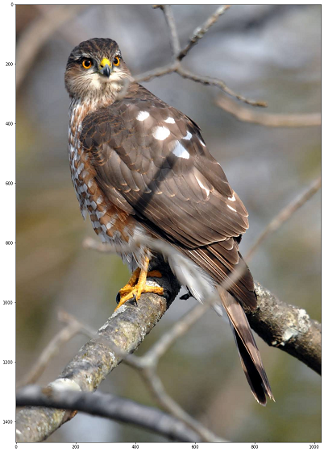
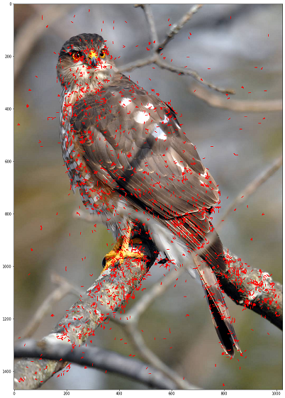

# SistemPakar_SIFTImplementation
A Class assigment of SIFT Implementation for safekeeping

- Rama Lesmana
- M. Luthfi Albiansyah

## Links
- [Google Colab](https://colab.research.google.com/drive/1c1UWOuCjtlFuBuJUQuJ7PjxYZBo_H8IZ?usp=sharing)

# SIFT
SIFT is an algorithm used to find points of interest/features from images that are invariant to scale. SIFT is divided into 4 main steps:
- Scale-space extrema detection
- Keypoint localization
- Orientation assignment
- Keypoint descriptor

## Original Image

Image taken from [here](https://www.animalspot.net)

## Point of Interest (PoI)

Pictured above final point of interests
